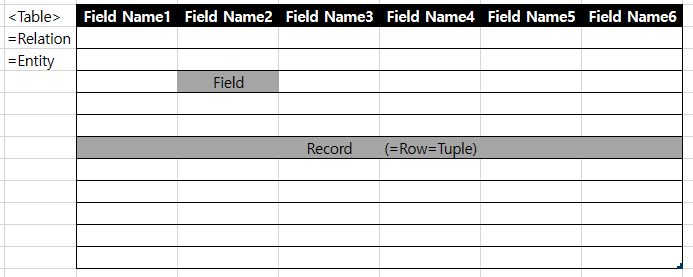

- 데이터베이스의 특징
  - 중복성 최소화
  - 일관성(Consistency) 유지
  - 무결성(Integrity)
    - 엉뚱한 데이터는 들어가지 않는다는 뜻
  - 독립성
    - ??
  - 공유성
    - 쉽게 공유할 수 있다
  - 보안성
    - 데이터베이스 관리 시스템(DBMS) 에서 자체적인 보안 기능 제공
  - 표준화

- 데이터베이스 사용자
- 데이터베이스 언어와 문법
  - DDL(Date Definition Language)
    - CREATE
      - CREATE DATABASE A: A 라는 이름의 데이터베이스 생성
      - CREATE TABLE A: A 라는 이름의 테이블을 현재 데이터베이스에 생성
    - DROP
    - ALTER
      - (기존 테이블에 데이터 추가/삭제)
        - ALTER TABLE ADD (A) (TYPE) ~~
        - ALTER TABLE DROP (A)
    - TRUNCATE
  - DML(Data Manipulation Language)
    - SELECT
      - DISTINCT
      - A AS B → A를 B라는 이름으로 바꾼다 (단가*수량 AS 가격 같은 것도 가능)
    - INSERT
    - UPDATE
    - DELETE
  - DCL(Data Control Language)
    - COMMIT
    - ROLLBACK
    - GRANT (권한 부여)
    - REVOKE (권한 박탈)

데이터베이스 구조

데이터베이스 시스템
- MySQL
  - MySQL Server
  - MySQL Router (여러 대의 서버로 분산 처리 시 사용)

JAVA 구현
- JDBC
  - DBMS 에 구애받지 않고 동작하도록 드라이버를 알아서 잡아주는 API

- 구현 방법
  - JDBC 드라이버 로드  
    _Class.forName_
  - DB 연결  
    _java.sql.Connection_ 객체 사용
  
  - SQL 처리 객체(Statement) 생성
    - executeQuery → 결과물을 받아오는 경우(Select)
    - executeUpdate → 동작만 하는 경우(Insert, Update, Delete)
      - 리턴 값: ResultSet

### 기타
- Transaction: 독립적으로 실행되는 명령 단위

